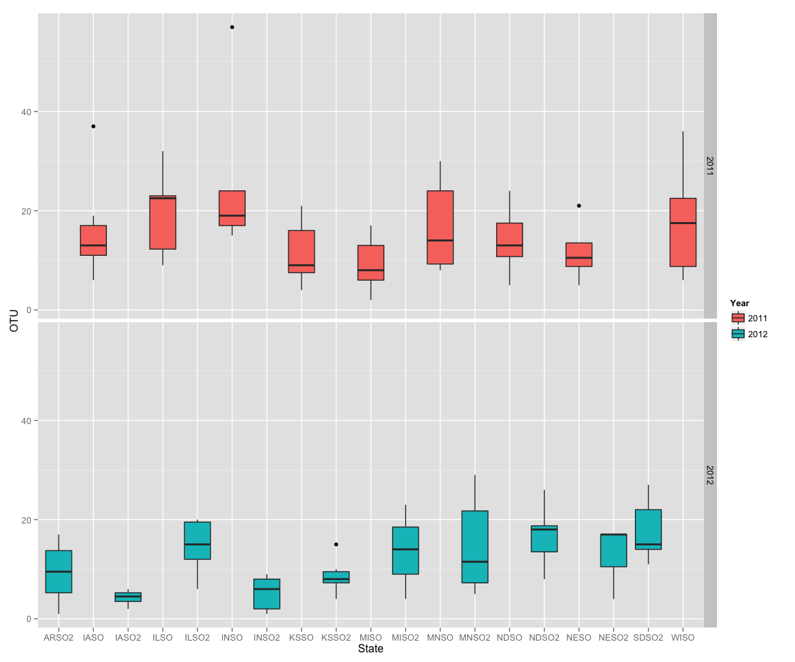

# Final Project QMEE
Alejandro Rojas  


File import into R maintaining the first row as header for the columns.  Also the samples from Arkansas 2011 were removed since this samples only came form a single field, not complying with the same sampling parameters used for the other samples.


```r
length(oomy_data$State)
```

```
## [1] 112
```

```r
stargazer(oomy_data, summary=TRUE, type="text")
```

```
## 
## ============================================================
## Statistic           N    Mean    St. Dev.   Min       Max   
## ------------------------------------------------------------
## Year               112 2,011.482  0.502    2,011     2,012  
## Number_of_isolates 112  26.455    23.703     1        191   
## Number_of_Species  112   7.795    3.708      1        18    
## Long               112  -92.266   4.680   -100.820  -84.014 
## Lat                112  41.921    3.065    33.797   47.957  
## OTU                112  13.768    8.773      1        57    
## Chao               112  52.488    79.252   1.000    666.000 
## chao_lci           112  27.178    40.926   0.000    366.598 
## chao_hci           112  135.605  166.189   0.000   1,236.551
## shannon            112   2.123    0.677    0.000     3.583  
## shannon_lci        112   1.729    0.741    0.000     3.356  
## shannon_hci        112   2.518    0.630    0.000     3.811  
## Precipitation      112  89.211    32.255   35.570   203.620 
## Temp               112  18.562    2.538    13.610   24.970  
## ------------------------------------------------------------
```

Transform year data into factor and data type is checked after transformation.


Histogram representing the distribution of number of species found per year:
 

Boxplots for number of species in each state, compiling the 6 fields per state

```r
#Boxplot for the number of species per state
ggplot(data=oomy_data, aes(y=OTU, x=State)) +
  geom_boxplot(aes(fill=Year)) + labs(y="OTU") + facet_grid(Year ~ .)
```

 

```r
#Boxplot for the shannon diversity index per state
ggplot(data=oomy_data, aes(y=shannon, x=State)) +
  geom_boxplot(aes(fill=Year)) + labs(y="Shannon index") + facet_grid(Year ~ .)
```

 

Plotting the temperature against the number of species observed or using shannon diversity index, there was not a striking pattern that correlates the two factors.  
  

However, precipitation seems to have a more visible pattern plotting this against the number of species for both years.

```r
#Evaluation of the effect of precipitation on the number of species
ggplot(data=oomy_data, aes(x=ct.precp, y=OTU)) +
  geom_point(colour="Black", size=4) + geom_point(aes(colour=Year), size=3) + labs(x="Precipitation (mm)", y="OTU")                                                                     
```

 

```r
#Evaluation of the effect of precipitation on the Shannon diversity index
ggplot(data=oomy_data, aes(x=ct.precp, y=shannon)) + 
   geom_point(colour="Black", size=4) + geom_point(aes(colour=Year), size=3) + labs(x="Precipitation (mm)", y="Shannon index")
```

 
