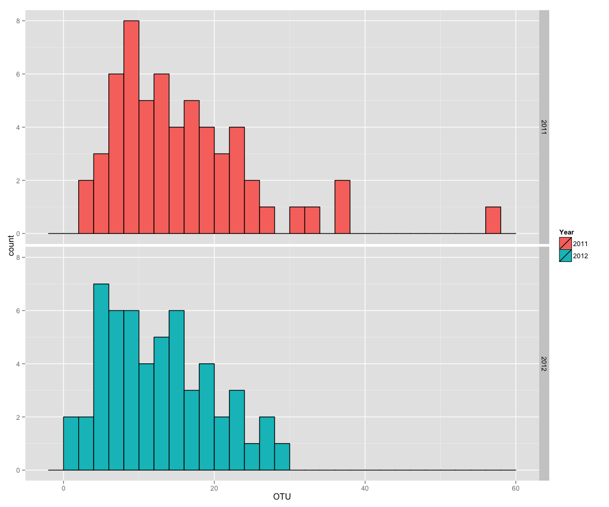

# Final Project QMEE
Alejandro Rojas  


File import into R maintaining the first row as header for the columns.  Also the samples from Arkansas 2011 were removed since this samples only came form a single field, not complying with the same sampling parameters used for the other samples.


```r
length(oomy_data$State)
```

```
## [1] 112
```

```r
stargazer(oomy_data, summary=TRUE, type="text")
```

```
## 
## ============================================================
## Statistic           N    Mean    St. Dev.   Min       Max   
## ------------------------------------------------------------
## Year               112 2,011.482  0.502    2,011     2,012  
## Number_of_isolates 112  26.455    23.703     1        191   
## Number_of_Species  112   7.795    3.708      1        18    
## Long               112  -92.266   4.680   -100.820  -84.014 
## Lat                112  41.921    3.065    33.797   47.957  
## OTU                112  13.768    8.773      1        57    
## Chao               112  52.488    79.252   1.000    666.000 
## chao_lci           112  27.178    40.926   0.000    366.598 
## chao_hci           112  135.605  166.189   0.000   1,236.551
## shannon            112   2.123    0.677    0.000     3.583  
## shannon_lci        112   1.729    0.741    0.000     3.356  
## shannon_hci        112   2.518    0.630    0.000     3.811  
## Precipitation      112  89.211    32.255   35.570   203.620 
## Temp               112  18.562    2.538    13.610   24.970  
## ------------------------------------------------------------
```

Transform year data into factor and data type is checked after transformation.


Histogram representing the distribution of number of species found per year:
 

Box plots for number of species in each state, compiling the 6 fields per state

```r
#Boxplot for the number of species per state
ggplot(data=oomy_data, aes(y=OTU, x=State)) +
  geom_boxplot(aes(fill=Year)) + labs(y="OTU") + facet_grid(Year ~ .)
```

 

```r
#Boxplot for the shannon diversity index per state
ggplot(data=oomy_data, aes(y=shannon, x=State)) +
  geom_boxplot(aes(fill=Year)) + labs(y="Shannon index") + facet_grid(Year ~ .)
```

 

Plotting the temperature against the number of species observed or using shannon diversity index, there was not a striking pattern that correlates the two factors.  
  

However, precipitation seems to have a more visible pattern plotting this against the number of species for both years.

```r
#Evaluation of the effect of precipitation on the number of species
ggplot(data=oomy_data, aes(x=ct.precp, y=OTU)) +
  geom_point(colour="Black", size=4) + geom_point(aes(colour=Year), size=3) + stat_smooth(method=lm, aes(fill=Year)) + labs(x="Precipitation (mm)", y="OTU")                                                                     
```

 

```r
#Evaluation of the effect of precipitation on the Shannon diversity index
ggplot(data=oomy_data, aes(x=ct.precp, y=shannon)) + 
   geom_point(colour="Black", size=4) + geom_point(aes(colour=Year), size=3) + stat_smooth(method=lm, aes(fill=Year)) + labs(x="Precipitation (mm)", y="Shannon index")
```

 

Evaluation of latitude in relation to species diversity, in order to explore the relationships, and also test a ecological perspective.
  

As part of the model selection, different linear models were set, using diversity (Shannon index and OTU) as response variable, using temperature, latitude, precipitation as predictor variables. 

```r
reg.null <- lm(shannon ~ 1, data=oomy_data)
reg.lat <- lm(shannon ~ ct.lat, data=oomy_data)
reg.temp <- lm(shannon ~ ct.temp, data=oomy_data)
reg.prec <- lm(shannon ~ ct.precp, data=oomy_data)
reg.lat.temp <- lm(shannon ~ ct.lat + ct.temp, data=oomy_data)
reg.lat.prec <- lm(shannon ~ ct.lat + ct.precp, data=oomy_data)
reg.temp.prec <- lm(shannon ~ ct.precp + ct.precp, data=oomy_data)
reg.latXtemp <- lm(shannon ~ ct.lat*ct.temp, data=oomy_data)
reg.latXprec <- lm(shannon ~ ct.lat*ct.precp, data=oomy_data)
reg.tempXprec <- lm(shannon ~ ct.precp*ct.precp, data=oomy_data)

reg2.null <- lm(OTU ~ 1, data=oomy_data)
reg2.lat <- lm(OTU ~ ct.lat, data=oomy_data)
reg2.temp <- lm(OTU ~ ct.temp, data=oomy_data)
reg2.prec <- lm(OTU ~ ct.precp, data=oomy_data)
reg2.lat.temp <- lm(OTU ~ ct.lat + ct.temp, data=oomy_data)
reg2.lat.prec <- lm(OTU ~ ct.lat + ct.precp, data=oomy_data)
reg2.temp.prec <- lm(OTU ~ ct.precp + ct.precp, data=oomy_data)
reg2.latXtemp <- lm(OTU ~ ct.lat*ct.temp, data=oomy_data)
reg2.latXprec <- lm(OTU ~ ct.lat*ct.precp, data=oomy_data)
reg2.tempXprec <- lm(OTU ~ ct.precp*ct.precp, data=oomy_data)
```


All the models were evaluated with delta AIC to determine the best fitting model using Shannon diversity index as a response variable.

```r
#AIC selection of model using OTU as response
aic.shannon
```

```
##               dAIC df weight
## reg.lat       0.0  3  0.3867
## reg.temp      1.8  3  0.1560
## reg.lat.prec  2.0  4  0.1445
## reg.lat.temp  2.0  4  0.1423
## reg.latXprec  3.6  5  0.0635
## reg.latXtemp  3.9  5  0.0542
## reg.null      5.5  2  0.0246
## reg.prec      7.4  3  0.0094
## reg.temp.prec 7.4  3  0.0094
## reg.tempXprec 7.4  3  0.0094
```

All the models were evaluated with delta AIC to determine the best fitting model using OTU number as a response variable.

```r
#AIC selection of model using OTU as response
aic.OTU
```

```
##                dAIC df weight
## reg2.latXprec  0.0  5  0.153 
## reg2.temp      0.1  3  0.144 
## reg2.lat.prec  0.2  4  0.140 
## reg2.prec      0.6  3  0.114 
## reg2.temp.prec 0.6  3  0.114 
## reg2.tempXprec 0.6  3  0.114 
## reg2.lat       1.2  3  0.083 
## reg2.null      1.8  2  0.061 
## reg2.lat.temp  2.1  4  0.053 
## reg2.latXtemp  3.7  5  0.024
```


The best fitting models were selected based on the delta AIC and other parameters were evaluated to confirm the selection of these models for both responses: Shannon diversity index and OTU number.

```r
#AIC, logLik and PRsq values for model using shannon
stargazer(AIC.shannon, type="text", summary = FALSE)
```

```
## 
## =======================
##              df   AIC  
## -----------------------
## reg.lat      3  227.981
## reg.lat.temp 4  229.981
## reg.latXtemp 5  231.911
## reg.latXprec 5  231.594
## -----------------------
```

```r
log.lik.shannon
```

```
## [1] -110.9904 -110.9904 -110.9554 -110.7970
```

```r
sapply(models.shannon,PRsq)
```

```
##                     [,1]       [,2]       [,3]       [,4]      
## FullModelRsquared   0.06486524 0.06486554 0.06545018 0.06808954
## FullModelAdjustedR2 0.05636401 0.04770711 0.03949046 0.04220314
## partials            List,2     List,2     List,2     List,2
```

```r
#Summary for models using Shannon
stargazer(models.shannon, type="text", digits=3, omit.stat="f", omit.table.layout="n")
```

```
## 
## =======================================================================================
##                                             Dependent variable:                        
##                     -------------------------------------------------------------------
##                                                   shannon                              
##                           (1)              (2)              (3)              (4)       
## ---------------------------------------------------------------------------------------
## ct.lat                  0.056***          0.056            0.056           0.049**     
##                         (0.020)          (0.042)          (0.042)          (0.024)     
##                                                                                        
## ct.temp                                  -0.0003           0.002                       
##                                          (0.051)          (0.052)                      
##                                                                                        
## ct.lat:ct.temp                                             0.002                       
##                                                           (0.007)                      
##                                                                                        
## ct.precp                                                                   -0.0002     
##                                                                            (0.002)     
##                                                                                        
## ct.lat:ct.precp                                                            -0.0004     
##                                                                            (0.001)     
##                                                                                        
## Constant                2.123***         2.123***         2.135***         2.125***    
##                         (0.062)          (0.062)          (0.078)          (0.063)     
##                                                                                        
## ---------------------------------------------------------------------------------------
## Observations              112              112              112              112       
## R2                       0.065            0.065            0.065            0.068      
## Adjusted R2              0.056            0.048            0.039            0.042      
## Residual Std. Error 0.658 (df = 110) 0.661 (df = 109) 0.664 (df = 108) 0.663 (df = 108)
## =======================================================================================
```

```r
#AIC, logLik and PRsq values for models using OTU
stargazer(AIC.otu, type="text", summary = FALSE)
```

```
## 
## ========================
##               df   AIC  
## ------------------------
## reg2.latXprec 5  805.474
## reg2.temp     3  805.604
## reg2.lat.prec 4  805.653
## ------------------------
```

```r
log.lik.OTU
```

```
## [[1]]
## 'log Lik.' -397.7368 (df=5)
## 
## [[2]]
## 'log Lik.' -399.8022 (df=3)
## 
## [[3]]
## 'log Lik.' -398.8263 (df=4)
```

```r
sapply(models.OTU,PRsq)
```

```
##                     [,1]       [,2]       [,3]      
## FullModelRsquared   0.06752698 0.03249472 0.04920817
## FullModelAdjustedR2 0.04162496 0.02369922 0.03176245
## partials            List,2     List,2     List,2
```

```r
#Summary for models usig OTU
stargazer(models.OTU, type="text", digits=3, omit.stat="f", omit.table.layout="n")
```

```
## 
## ======================================================================
##                                    Dependent variable:                
##                     --------------------------------------------------
##                                            OTU                        
##                           (1)              (2)              (3)       
## ----------------------------------------------------------------------
## ct.lat                   0.192                             0.413      
##                         (0.306)                           (0.268)     
##                                                                       
## ct.precp                 0.028                             0.044*     
##                         (0.028)                           (0.025)     
##                                                                       
## ct.lat:ct.precp          -0.014                                       
##                         (0.010)                                       
##                                                                       
## ct.temp                                  -0.623*                      
##                                          (0.324)                      
##                                                                       
## Constant               13.831***        13.768***        13.768***    
##                         (0.813)          (0.819)          (0.816)     
##                                                                       
## ----------------------------------------------------------------------
## Observations              112              112              112       
## R2                       0.068            0.032            0.049      
## Adjusted R2              0.042            0.024            0.032      
## Residual Std. Error 8.589 (df = 108) 8.669 (df = 110) 8.633 (df = 109)
## ======================================================================
```

Evaluation of coefficient plots for shannon diversity index and OTU number.

```r
#Coefficient plots for Shannon diversity index
par(mfrow = c(2,2))
sapply(models.shannon,coefplot)
```

 

```r
#Coefficient plots for OTU number
par(mfrow = c(2,2))
sapply(models.OTU,coefplot)
```

 

Evaluation of ACF on the residuals for the different models for both responses

```r
#ACF for models using Shannon
par(mfrow = c(2,2))
acf(resid(reg.lat))
acf(resid(reg.lat.temp))
acf(resid(reg.latXtemp))
acf(resid(reg.latXprec))
```

 

```r
#ACF for models using Shannon
par(mfrow = c(2,2))
acf(resid(reg2.temp))
acf(resid(reg2.lat.prec))
acf(resid(reg2.latXprec))
```

 

Evaluation VIF terms for best fitted complex models

```r
#Shannon diversity model
vif(reg.lat.temp)
```

```
##   ct.lat  ct.temp 
## 4.210666 4.210666
```

```r
#OTU number model
vif(reg2.latXprec)
```

```
##          ct.lat        ct.precp ct.lat:ct.precp 
##        1.327676        1.188072        1.534181
```

Plotting of diagnostic plots for best fitted complex models

```r
par(mfrow = c(2,2))
#Shannon diversity model
plot(reg.lat.temp)
```

 

```r
#OTU number model
plot(reg2.latXprec)
```

 


**residuals resampling for model based on Shannon ~ lat + temp**


```r
resid.lm.boot <- function(mod.obj=reg.lat.temp, dat=oomy_data) {
  resids=resid(mod.obj)
  fit.val=fitted(mod.obj)
  mod.matr <- model.matrix(mod.obj)
  #generating new values for each y[i] (vector Y), by adding the bootstrapped residuals to the fitted model.
  Y <- fit.val + sample(resids,length(resids), replace=T)
  model.boot <- lm( Y ~ 0 + mod.matr, data=dat) # refit model with new Y values
  coef(model.boot) # Extract the co-efficients
  }

N.boot = 5000
residual.boot.N <- t(replicate(N.boot, resid.lm.boot()))
colnames(residual.boot.N) <- c("Intercept","Latitude","Temperature")
```

**Histograms of coefficients after bootstrap residual resampling for shannon ~ lat + temp**


 

**residuals resampling for model based on OTU ~ lat + prec + lat*prec**


```r
resid.lm.boot2 <- function(mod.obj=reg2.latXprec, dat=oomy_data) {
  resids=resid(mod.obj)
  fit.val=fitted(mod.obj)
  mod.matr <- model.matrix(mod.obj)
  #generating new values for each y[i] (vector Y), by adding the bootstrapped residuals to the fitted model.
  Y <- fit.val + sample(resids,length(resids), replace=T)
  model.boot <- lm( Y ~ 0 + mod.matr, data=dat) # refit model with new Y values
  coef(model.boot) # Extract the co-efficients
  }

N.boot2 = 5000
residual.boot.N2 <- t(replicate(N.boot2, resid.lm.boot2()))
colnames(residual.boot.N2) <- c("Intercept","Latitude","Precipitation","Lat:Precp")
```

**Histograms of coefficients after bootstrap residual resampling for OTU ~ lat + prec + lat*prec**


```r
par(mfcol=c(2,2), mar=c(4,4,0.5,0.5), oma=c(1.5,2,1,1))
MultipleHistograms2()
```

 
